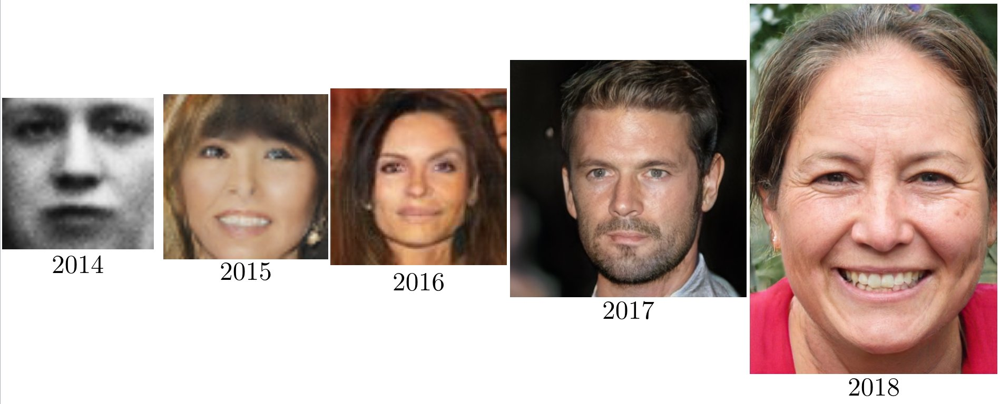
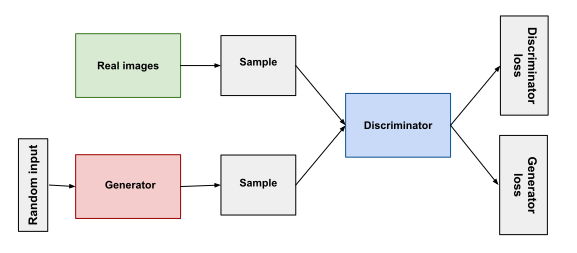

# What is Generative Adversarial Network(GAN)

A **GAN, or Generative Adversarial Network** is a **machine learning framework**. It can generate new data points by sampling from this distribution (i.e. choosing combinations with large probability). So, It's a  **probability distribution**. In the case of images, GANs means you have a probability for every possible combination of pixel values. **For example, generating face, hand digit generation, etc**

GANs have 2 major component. There are - 

**Generator** : Generative models(G) can generate new data instances. It captures the data distribution. In short,   Generator is to create data in such a way that it can fool the discriminator.

**Discriminator**  : Discriminative models(D) discriminate between different kinds of data instances. It estimates
the probability that a sample came from the training data rather than Generative models(G). In short, Discriminator is to distinguish between actual and generated (fake) data.

This
framework corresponds to a minimax two-player game. There are many kinds of generative model. GANs are just one kind of generative model.

# Some  Generative examples of GANs Work

Figure : Visualization of samples from the model.

# The GANs progress on face generation

## All papers link
[GAN 2014](https://arxiv.org/abs/1406.2661)

[DCGAN 2015](https://arxiv.org/abs/1511.06434)

[CoGAN 2016](https://arxiv.org/abs/1606.07536)

[PGAN 2017](https://arxiv.org/abs/1710.10196)

[StyleGAN 2018](https://arxiv.org/abs/1812.04948)

# Basic structure behind the GANs

Here some pictures of the whole system -

<!--  -->

## Generative adversarial nets are trained by simultaneously

Here, 
**Discriminative distribution (D, blue, dashed line)** so that it discriminates between samples from **the data generating distribution (black, dotted line)** p(x) from those of the **generative distribution p(g) (G) (green, solid line)**

From this figure we say that -

a. Poorly fit model

b. After updating D

c. After updating G

d. Mixed strategy equilibrium(p(g) = p(data)) or Global Optimality of p(g) = p(data)

## Backpropagation in  discriminator training

## Backpropagation in generator training

# GANs Loss function

In this equation we say,This formula look like **binary cross-entropy loss function**. D and G play the following two-player minimax game with value function V (G, D).

In this loss function there have some problem-

**Vanishing Gradient**: if your discriminator is too good, then generator training can fail due to vanishing gradients. In effect, an optimal discriminator doesn't provide enough information for the generator to make progress.

**Mode Collapse** : During training, the generator may get stuck into a setting where it always produces the same output.

# GANs Algorithm

# Resources

[Pytorch Vanilla Gan](https://www.kaggle.com/rafat97/pytorch-vanilla-gan)

[Generative Adversarial Networks Original paper](https://arxiv.org/abs/1406.2661)

[The math behind GANs](https://towardsdatascience.com/the-math-behind-gans-generative-adversarial-networks-3828f3469d9c)

[Papers with code](https://paperswithcode.com/method/gan)

[GANs Google](https://developers.google.com/machine-learning/gan/)

[GANs](https://drive.google.com/drive/folders/1lHtjHQ8K7aemRQAnYMylrrwZp6Bsqqrb)

[Introductory Slide](https://www.slideshare.net/jongwookkim/a-short-introduction-to-generative-adversarial-networks)